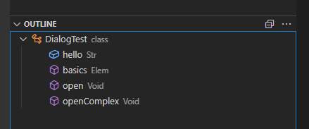
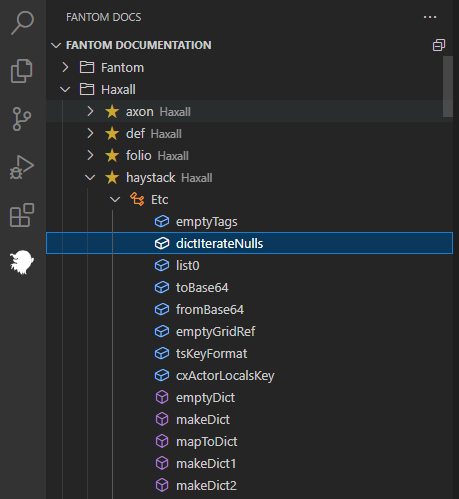
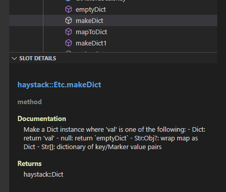
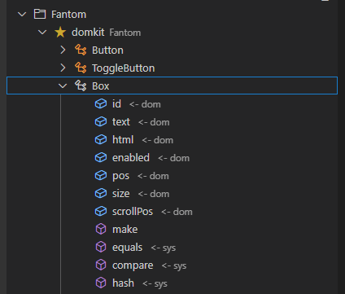
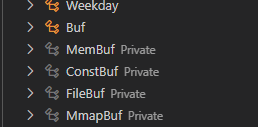
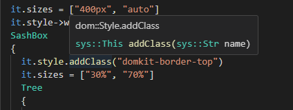

# Fantom Support Extension for Visual Studio Code

Fantom support for vscode, built using the Language Server Protocol. 

Here's the thing - I have no idea what I'm doing. This is my first ever typescript (or javascript) project. I built this while trying to learn Fantom, largely just to help myself out. 

So... set your expectations accordingly :D 

## Features

- **Syntax Highlighting**: Builds on the existing syntax highlighting provided by [mgiannini](https://packagecontrol.io/packages/Fantom) and [amackay](https://github.com/a-mackay/fantom-syntax-highlighting), adding highlights for classes, methods, fields, types, and (soon, if i can smooth it out) variables.
- **Outline View**: For visualizing classes, methods, and fields.
- **Fantom Docs**: Navigable fantom docs (built from pods) in the vscode sidebar. 

## Features Planned/WIP
- **Auto-Completion & Code Snippets**: Intelligent code suggestions tailored to Fantom, improving coding speed and accuracy. Predefined snippets for common Fantom constructs, reducing repetitive typing.
- **Code Formatting**: So you're always up to Brian's standards ;) 
- **Hover Documentation**: Hover over classes, types, methods, fields to view information. 

## WIP, Improvements Needed, & Known Bugs

- Syntax highlighting 
    - Needs more thorough testing, I haven't handled all the scenarios yet. 
    - Some special chars are accidentally included in the captures, like ()
- Docs
    - Need to connect hover docs & sidebar & centralize processing
    - Slot details are not always filled in properly, displaying {placeholder}
    - Add "go-to" to quickly find docs in sidebar
    - Add search functionality for sidebar 
    - Auto-favorite any classes/methods used in current workspace 
- Lots, lots more to do, but just taking it one step at a time ;) 

## Screenshots

### Outline View

### Sidebar Docs

Includes support for private classes & inherited slots 

### Hover Documentation

